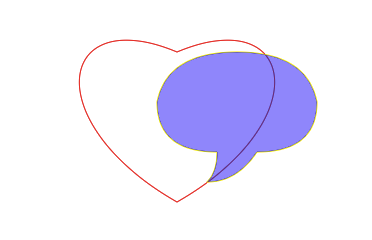

# Canvas

## 认识canvas

画布canvas是H5中一个重要的概念，它面向开发人员提供了非常底层的绘图接口，使得绘制速度可以大幅提高，这对游戏等领域极为重要。

canvas看起来和 img 元素很相像，唯一的不同就是它并没有 src 和 alt 属性。实际上，canvas 标签只有两个属性---- width和height。

创建一个简单的画布

canvas初始化默认的width:300px;  height:150px

```js
  <!-- 
    id: 标识元素的唯一性
    width：画布宽度
    height：画布的高度
  -->
  <canvas id="emerge" width="600" height="400" ></canvas>
  <script>
    // 1.找到canvas对象
    var c1 = document.getElementById("emerge");
    // 2.获取画笔，上下文对象
    var ctx = c1.getContext("2d");
    // 3.绘制图形
    // 3.1 绘制矩形 fillRect(x, y, width, height)
    ctx.fillRect(100, 200, 300, 300)
  </script>
```

    canvas元素与img标签的不同之处在于，就像video，audio，或者 picture元素一样，很容易定义一些替代内容。由于某些较老的浏览器（尤其是 IE9 之前的 IE 浏览器）或者文本浏览器不支持 HTML 元素"canvas"，在这些浏览器上应该提示当前浏览器布置canvas api。

    不支持canvas的浏览器将会忽略canvas，并在其中渲染canvas中内容。而支持canvas的浏览器将会忽略在容器中包含的内容，并且只是正常渲染 canvas。

```html
  <canvas id="emerge" width="600" height="400" >
    当前浏览器不支持canvas，请下载最新浏览器
    <a href="https://www.google.cn/chrome/">下载Chrome</a>
  </canvas>
```

## 渲染上下文（The rendering context）

    `<canvas>` 元素创造了一个固定大小的画布，它公开了一个或多个**渲染上下文**，其可以用来绘制和处理要展示的内容。将会将注意力放在 2D 渲染上下文中。

    其他种类的上下文也许提供了不同种类的渲染方式；比如， WebGL 使用了基于OpenGL ES的 3D 上下文。 

2.CanvasRenderingContext2D

    可为 [`<canvas>`](https://developer.mozilla.org/zh-CN/docs/Web/HTML/Element/canvas) 元素的绘图表面提供2D 渲染上下文。它用于绘制形状，文本，图像和其他对象。

```js
    // 1.找到canvas对象
    var c1 = document.getElementById("emerge");
    // 2.获取画笔，上下文对象
    var ctx = c1.getContext("2d");
```

兼容性检查

    替换内容是用于在不支持`<canvas>`标签的浏览器中展示的。通过简单的测试 getContext() 方法的存在，脚本可以检查编程支持性。上面的代码片段现在变成了这个样子：

```js
var c1 = document.getElementById('emerge');

if (c1.getContext){
  var ctx = canvas.getContext('2d');
  // drawing code here
} else {
  // canvas-unsupported code here
  c1.innerText = '当前浏览器不支持canvas，请下载最新浏览器'
}
```

一个简单例子

绘制了两个有趣的长方形，其中的一个有着 alpha 透明度。

```html
<html>
  <head>
    <script type="application/javascript">
      function draw() {
              // 1.找到canvas对象
              var c1 = document.getElementById("emerge");
              // 2.获取画笔，上下文对象
              var ctx = c1.getContext("2d");
              // 处理兼容问题，不支持canvas浏览器
              if(!ctx.getContext) c1.innerText = '当前浏览器不支持canvas，请下载最新浏览器'

              // 3.绘制图形
              // 3.1 绘制矩形 fillRect(x, y, width, height)
              ctx.fillStyle='rgba(218,255,0, 0.4)';
              ctx.fillRect(100, 150, 350, 150)

              ctx.fillStyle='rgba(0,0,255, 0.5)';
              ctx.fillRect(150, 200, 350, 150)
      }
    </script>
  </head>
  <body onload="draw();">
    <canvas id="canvas" width="150" height="150"></canvas>
  </body>
</html>
```

draw() 的函数，当页面加载结束的时候就会执行这个函数

## canvas绘制基本图形

接下来将学使用canvas进行绘制矩形，三角形，直线，圆弧和曲线，变得熟悉这些基本的形状。


模板中有个宽 150px, 高 150px 的 canvas 元素。如上图所示，canvas 元素默认被网格所覆盖。通常来说网格中的一个单元相当于 canvas 元素中的一像素。栅格的起点为左上角（坐标为（0,0））。所有元素的位置都相对于原点定位。所以图中蓝色方形左上角的坐标为距离左边（X 轴）x 像素，距离上边（Y 轴）y 像素（坐标为（x,y））

### 绘制矩形

不同于 SVG，canvas 只支持两种形式的图形绘制：矩形和路径（由一系列点连成的线段）

canvas 提供了三种方法绘制矩形：

#### 填充矩形 fillRect()

```js
ctx.fillRect(x, y, width, height);
```

`fillRect()`方法绘制一个填充了内容的矩形，这个矩形的开始点（左上点）在`(x, y)` ，它的宽度和高度分别由`width` 和 `height` 确定，填充样式由当前的`fillStyle` 决定

```html
<body>
  <div>
    <canvas id="cav" width="150" height="150" style="border: 1px dashed;">
    </canvas>
  </div>
  <script>
    // 1.找到canvas对象
    var cav = document.getElementById("cav")
    // 2.获取画布的 2D 渲染上下文
    var ctx2D = cav.getContext('2d'); 
    if (ctx2D.getContext) cav.innerText = '当前浏览器不支持canvas，请下载最新浏览器'

    // 3.绘制图形
    // 3.1 绘制矩形 fillRect(x, y, width, height) fillRect填充绘制
    // fillStyle 属性让长方形变成绿色
    // fillRect() 方法将它的左上角放在 (x:50, y:50)，把它的大小设置成宽 50 高 50
    ctx2D.fillStyle='rgba(67,142,219, 1)';
    ctx2D.fillRect(50, 50, 50, 50)

    // 拆分写法
    ctx2D.fillStyle='rgba(255,0,0, 1)';
    ctx2D.rect(100, 100, 50, 50)
    ctx2D.fill()
  </script>
</body>
```


#### 描边矩形 strokeRect()

```js
ctx.strokeRect(x, y, width, height);
```

方法绘制一个描边矩形，其起点为`(x, y)` ，其大小由宽度和高度指定。

```html
  <div>
    <canvas id="cav" width="150" height="150" style="border: 1px dashed;">
    </canvas>
  </div>
  <script>
    // 1.找到canvas对象
    var cav = document.getElementById("cav")
    // 2.获取画布的 2D 渲染上下文
    var ctx2D = cav.getContext('2d'); 
    if (ctx2D.getContext) cav.innerText = '当前浏览器不支持canvas，请下载最新浏览器'

    // 3.绘制图形 fill英文单词是满足 填充
    // 3.1 绘制矩形 fillRect(x, y, width, height) fillRect填充模糊
    // fillStyle 属性让长方形变成绿色
    // fillRect() 方法将它的左上角放在 (x:50, y:50)，把它的大小设置成宽 50 高 50
    ctx2D.fillStyle='rgba(67,142,219, 1)';
    ctx2D.fillRect(50, 50, 50, 50)

    // 拆分写法
    ctx2D.strokeStyle='rgba(255,0,0, 1)';
    ctx2D.rect(100, 100, 50, 50)
    ctx2D.stroke()
  </script>
```


#### 清除绘制矩形 clearRect()

`clearRect()` 方法在一个矩形区域内设置所有像素都是透明的 (`rgba(0,0,0,0)`)。这个矩形范围的左上角在 `(x, y)`，宽度和高度分别由 `width` 和`height`确定。

从左上角某个坐标开始清除比如：(60, 60 )

```html
<body>
  <div>
    <canvas id="cav" width="150" height="150" style="border: 1px dashed;">
    </canvas>
  </div>
  <script>
    // 1.找到canvas对象
    var cav = document.getElementById("cav")
    // 2.获取画布的 2D 渲染上下文
    var ctx2D = cav.getContext('2d'); 
    if (ctx2D.getContext) cav.innerText = '当前浏览器不支持canvas，请下载最新浏览器'

    // 3.绘制图形 
    // 3.1 绘制矩形 fillRect(x, y, width, height) fillRect路径绘制
    ctx2D.strokeStyle = "green";
    ctx2D.strokeRect(50, 50, 50, 50)

    // 再次绘制一个矩形
    ctx2D.fillStyle='red';
    ctx2D.fillRect(100,100, 50,50);

    // 清除画布上绘制的矩形
    // 从左上角清除，清除宽度和 高度 与canvas画布一样大小
    // ctx2D.clearRect(0, 0, cav.width, cav.height);
    // ctx2D.clearRect(60, 60, 50, 50);
    let height = 0
    let clearTime = setInterval(() => {
      if(height >= 50) clearInterval(clearTime)
      height++
      ctx2D.clearRect(60, 60, height, height);
    },100)

  </script>
</body>
```


#### 分段绘制图形 beginPath 和 closePath

当画布上有两个不同的图形，一个图形是描边绘制，另一种是填充绘制，就需要分段绘制图形beginPath 和 closePath

```html
<body>
  <div>
    <canvas id="cav" width="150" height="150" style="border: 1px dashed;">
    </canvas>
  </div>
  <script>
    // 1.找到canvas对象
    var cav = document.getElementById("cav")
    // 2.获取画布的 2D 渲染上下文
    var ctx2D = cav.getContext('2d'); 
    if (ctx2D.getContext) cav.innerText = '当前浏览器不支持canvas，请下载最新浏览器'

    // 3.绘制图形 
    // 3.1 绘制矩形 fillRect(x, y, width, height) fillRect路径绘制
    // 分段绘制图形beginPath 和 closePath
    ctx2D.beginPath();
    ctx2D.strokeStyle = "green";
    // ctx2D.strokeRect(50, 50, 50, 50)
    // 拆分写法
    ctx2D.rect(50, 50, 50, 50)
    ctx2D.stroke() // 显示路径
    ctx2D.closePath();

    // 再次绘制一个矩形
    ctx2D.beginPath();
    ctx2D.fillStyle='red';
    // ctx2D.fillRect(100,100, 50,50);
    ctx2D.rect(100,100, 50,50);
    ctx2D.fill();
    ctx2D.closePath();

  </script>
</body>
```

### 绘制圆形

圆弧路径的圆心在 *(x, y)* 位置，半径为 *r*，根据*anticlockwise* （默认为顺时针）指定的方向从 *startAngle* 开始绘制，到 *endAngle* 结束。

```js
ctx.arc(x轴, y轴, radius半径, startAngle开始角度, endAngle结束角度, anticlockwise：是否顺时针);
```

```html
<body>
  <canvas id="cav" width="600" height="400" >
    当前浏览器不支持canvas，请下载最新浏览器
    <a href="https://www.google.cn/chrome/">下载Chrome</a>
  </canvas>

  <script>
    // 1.找到canvas对象
    var cav = document.getElementById("cav")
    // 2.获取画布的 2D 渲染上下文
    var ctx2D = cav.getContext('2d'); 
    if (!ctx2D.getContext) cav.innerText = '当前浏览器不支持canvas，请下载最新浏览器'

    // arc绘制圆弧
    // ctx.arc(圆心x,圆心y,半径, 开始角度, 结束角度, 顺时针逆时针)
    ctx2D.beginPath();
    // 0 到 360°
    ctx2D.arc(200, 200, 50, 0, 2 * Math.PI, true);
    ctx2D.fill(); // 填充画圆
    ctx2D.closePath();

    ctx2D.beginPath();
    ctx2D.strokeStyle='green';
    // 0 到 90°
    ctx2D.arc(300, 300, 50, 0,  Math.PI/2, false);
    ctx2D.stroke(); // 描边画圆
    ctx2D.closePath();
  </script>
</body>
```


### 绘制路径

图形的基本元素是路径。路径是通过不同颜色和宽度的线段或曲线相连形成的不同形状

1. 首先，你需要创建路径起始点。
2. 然后你使用画图命令去画出路径。
3. 之后你把路径封闭。
4. 一旦路径生成，你就能通过描边或填充路径区域来渲染图形。

beginPath()：新建一条路径，生成之后，图形绘制命令被指向到路径上生成路径。

closePath()：闭合路径之后图形绘制命令又重新指向到上下文中。

stroke()：通过线条来绘制图形轮廓。

fill()：通过填充路径的内容区域生成实心的图形。

moveTo()：新建一个起点，起始点移动到 (x，y) 坐标的方法。

### 绘制直线

`lineTo` 方法画一条直线，使用 [`beginPath()`](https://developer.mozilla.org/zh-CN/docs/Web/API/CanvasRenderingContext2D/beginPath "beginPath()") 绘制路径的起始点，使用 `moveTo()`移动画笔，使用 [`stroke()`](https://developer.mozilla.org/zh-CN/docs/Web/API/CanvasRenderingContext2D/stroke "stroke()") 方法真正地画线。

```js
const canvas = document.getElementById("canvas");
const ctx = canvas.getContext("2d");

ctx.beginPath(); // Start a new path
ctx.moveTo(30, 50); // Move the pen to (30, 50)
ctx.lineTo(150, 100); // Draw a line to (150, 100)
ctx.stroke(); // Render the path
```

### 绘制三角

```html
    <script>
      // 1.找到canvas对象
      var cav = document.getElementById("cav");
      // 2.获取画布的 2D 渲染上下文
      var ctx2D = cav.getContext("2d");
      if (!ctx2D.getContext) cav.innerText = "当前浏览器不支持canvas，请下载最新浏览器";

      // 通过moveTo和lineTo 绘制直线
      ctx2D.beginPath();
      ctx2D.moveTo(100, 20);
      ctx2D.lineTo(10, 20);
      ctx2D.stroke();
      ctx2D.closePath();

      ctx2D.beginPath();
      ctx2D.setLineDash([5, 15, 10]); // 设置虚线
      ctx2D.moveTo(100, 30);
      ctx2D.lineTo(20, 30);
      ctx2D.stroke();
      ctx2D.closePath();

      // 通过moveTo和lineTo绘制三角形
      ctx2D.beginPath();
      ctx2D.setLineDash([]);
      ctx2D.moveTo(120, 50); // 属于起点 (x:120, y:50)
      ctx2D.lineTo(50, 120); // 起点到 （x:50, y:120)
      ctx2D.lineTo(50, 50);
      ctx2D.lineTo(120, 50);
      ctx2D.stroke();
      ctx2D.closePath();

      ctx2D.beginPath();
      ctx2D.moveTo(130, 60); // 属于起点 (x:120, y:50)
      ctx2D.lineTo(130, 130); // 起点到 （x:50, y:120)
      ctx2D.lineTo(60, 130);
      ctx2D.lineTo(130, 60);

      ctx2D.fill();
      ctx2D.closePath();
    </script>
```


### 移动笔触

一个非常有用的函数，而这个函数实际上并不能画出任何东西，也是上面所描述的路径列表的一部分。通常就是moveTo() 将笔触移动到指定的坐标 x 以及 y 上。

可以想象一下在纸上作业，一支钢笔或者铅笔的笔尖从一个点到另一个点的移动过程。

下面是绘制一个笑脸示例：

```html
  <canvas id="cav" width="600" height="400" >
    当前浏览器不支持canvas，请下载最新浏览器
    <a href="https://www.google.cn/chrome/">下载Chrome</a>
  </canvas>

  <script>
    // 1.找到canvas对象
    var cav = document.getElementById("cav")
    // 2.获取画布的 2D 渲染上下文
    var ctx2D = cav.getContext('2d'); 
    if (!ctx2D.getContext) cav.innerText = '当前浏览器不支持canvas，请下载最新浏览器'

    ctx2D.beginPath();
    ctx2D.strokeStyle='green';
    // 0 到 90°
    ctx2D.arc(300, 200, 100, 0,  2*Math.PI, false); // 脸

    ctx2D.moveTo(280, 175); // 计算方式，移动到距离中心点 (下一次要画圆中心点+画圆的半径)(260 + 20, 175)
    ctx2D.arc(260, 175, 20, 0, Math.PI*2, false); // 左眼睛

    ctx2D.moveTo(360, 175);
    ctx2D.arc(340, 175, 20, 0, Math.PI*2, false); // 右眼睛

    ctx2D.moveTo(375, 200);
    ctx2D.arc(300, 200, 75, 0, Math.PI, false); // 嘴巴眼睛
    ctx2D.stroke(); // 描边画圆
    ctx2D.closePath();
  </script>
```


### 绘制圆弧

基础点是蓝色的，两个控制点是红色的。

根据当前描点与给定的控制点 1 连接的直线，和控制点 1 与控制点 2 连接的直线，作为使用指定半径的圆的**切线**，画出两条切线之间的弧线路径。

```js
ctx.arcTo(x1, y1, x2, y2, radius);
```


下面简单的代码片段

```html
  <canvas id="cav" width="600" height="400" >
    当前浏览器不支持canvas，请下载最新浏览器
    <a href="https://www.google.cn/chrome/">下载Chrome</a>
  </canvas>
  <script>
    // 1.找到canvas对象
    var cav = document.getElementById("cav")
    // 2.获取画布的 2D 渲染上下文
    var ctx2D = cav.getContext('2d'); 
    if (!ctx2D.getContext) cav.innerText = '当前浏览器不支持canvas，请下载最新浏览器'

    ctx2D.setLineDash([]);
    // arcTo(x1,y1,x2,y2,r)绘制圆弧arcTo(x坐标1,y坐标1, x坐标2,y坐标2, 半径)
    ctx2D.beginPath();
    // 先有设置起始点为
    ctx2D.moveTo(300, 100); // 第一个点，即描点
    ctx2D.arcTo(300, 200, 200, 100, 40); // 圆弧，通过三个点，来确定圆弧 弧度
    ctx2D.stroke();
    ctx2D.closePath();

    // 先有设置起始点为
    ctx2D.fillStyle='rgba(255,0,0,0.8)';
    ctx2D.fillRect(300, 100, 10, 10);

    ctx2D.fillStyle='rgba(255,255,0,0.8)';
    ctx2D.fillRect(300, 200, 10, 10);

    ctx2D.fillRect(200, 100, 10, 10);

    // 画虚线setLineDash([]); 传入一个数组
    ctx2D.setLineDash([5,5]);
    ctx2D.beginPath();
    ctx2D.moveTo(300, 100); // 第一个点
    ctx2D.lineTo(300, 200,);
    ctx2D.lineTo(200, 100);
    ctx2D.stroke();
    ctx2D.closePath();

    ctx2D.beginPath();
    ctx2D.arc(260, 103, 40, 0, 2 * Math.PI);
    ctx2D.stroke();
    ctx2D.closePath();
  </script>
```

### 绘制贝塞尔曲线

贝塞尔曲线(Bézier curve)，又称贝兹曲线或贝济埃曲线，是应用于二维图形应用程序的数学曲线。

一般的矢量图形软件通过它来精确画出曲线，贝兹曲线由线段与节点组成，节点是可拖动的支点，线段像可伸缩的皮筋，我们在绘图工具上看到的钢笔工具就是来做这种矢量曲线的。

比如项ps中的钢笔工具


### 一次贝塞尔曲线(线性贝塞尔曲线)

​ 一次贝塞尔曲线其实是一条直线。


### 二次贝塞尔曲线

```js
ctx.moveTo(x1, y1); // 启点坐标
quadraticCurveTo(cp1x, cp1y, x2, y2) // 控制点坐标
```

绘制二次贝塞尔曲线，cp1x,cp1y 为一个控制点，x,y 为结束点。


P0 到 P1 运行运动轨迹点（时间0.10到1.00），与P1到P2运行运动轨迹点，两点这相连的直线形成切线，切点形成曲线


```html
  <script>
    // 1.找到canvas对象
    var cav = document.getElementById("cav")
    // 2.获取画布的 2D 渲染上下文
    var ctx2D = cav.getContext('2d'); 
    if (!ctx2D.getContext) cav.innerText = '当前浏览器不支持canvas，请下载最新浏览器'

    // 绘制贝塞尔曲线
    // ctx.quadraticCurveTo(控制x,控制y,半径, 结束点x，结束点y)
    ctx2D.beginPath();
    ctx2D.moveTo(200, 150); // 起始点
    ctx2D.quadraticCurveTo(250, 50, 350, 150);
    ctx2D.strokeStyle='red';

    ctx2D.stroke();
    ctx2D.closePath();

    ctx2D.beginPath();
    ctx2D.fillStyle='rgba(255, 255, 0, 0.8)';
    ctx2D.arc(200, 150, 5, 0, Math.PI * 2); // 起始点

    ctx2D.moveTo(350, 150);
    ctx2D.arc(350, 150, 5, 0, Math.PI * 2); // 终点
    ctx2D.fill();
    ctx2D.closePath();

    // 控制点
    ctx2D.beginPath();
    ctx2D.arc(250, 50, 5, 0, Math.PI * 2);
    ctx2D.fillStyle='rgba(255, 0, 0, 0.8)';
    ctx2D.fill();
    ctx2D.closePath();

    // 三个点连线
    ctx2D.beginPath();
    ctx2D.setLineDash([3,3]);
    ctx2D.strokeStyle='gray';
    ctx2D.moveTo(200, 150); 
    ctx2D.lineTo(250, 50);
    ctx2D.lineTo(350, 150);
    ctx2D.stroke();
    ctx2D.closePath();

    // 切线
    ctx2D.beginPath();
    ctx2D.setLineDash([]);
    ctx2D.strokeStyle='green';
    ctx2D.moveTo(215, 120); 
    ctx2D.lineTo(280, 80);
    ctx2D.stroke();
  </script>
```


使用多个贝塞尔曲线来渲染对话气泡

```html
  <script>
    // 1.找到canvas对象
    var cav = document.getElementById("cav")
    // 2.获取画布的 2D 渲染上下文
    var ctx2D = cav.getContext('2d'); 
    if (!ctx2D.getContext) cav.innerText = '当前浏览器不支持canvas，请下载最新浏览器'

    // 绘制贝塞尔曲线
    // ctx.quadraticCurveTo(控制x,控制y,半径, 结束点x，结束点y)
    ctx2D.beginPath();
    ctx2D.moveTo(200, 150); // 起始点
    ctx2D.quadraticCurveTo(210, 100, 280, 100);
    ctx2D.quadraticCurveTo(350, 100, 360, 150);
    ctx2D.quadraticCurveTo(360, 200, 300, 200);
    ctx2D.quadraticCurveTo(280, 230, 250, 230);
    ctx2D.quadraticCurveTo(260, 220, 260, 200);
    ctx2D.quadraticCurveTo(200, 200, 200, 150);
    ctx2D.strokeStyle='red';

    ctx2D.stroke();
    ctx2D.closePath();
  </script>
```

### 三次贝塞尔曲线

```js
ctx.moveTo(x1, y1); // 启点坐标
bezierCurveTo(cp1x, cp1y, cp2x, cp2y, x, y) // 控制点坐标cp1、控制点2坐标 cp2
```

绘制三次贝塞尔曲线，cp1x,cp1y为控制点一，cp2x,cp2y为控制点二，x,y为结束点。


P0 到 P1 运行运动轨迹点，与P1 到 P2运行运动轨迹点，两点之间连线，绿色Q0 与 Q1

P1 到 P2 运行运动轨迹点，与P2 到 P3运行运动轨迹点，两点之间连线，绿色Q1 与 Q2

Q0 与 Q1 之间的连线，Q1 与 Q2之间的连线，形成R0 与 R1


上图的图能够很好的描述两者的关系，二次贝塞尔曲线有一个开始点（蓝色）、一个结束点（蓝色）以及一个控制点（红色），而三次贝塞尔曲线有两个控制点。

```html
  <script>
    // 1.找到canvas对象
    var cav = document.getElementById("cav")
    // 2.获取画布的 2D 渲染上下文
    var ctx2D = cav.getContext('2d'); 
    if (!ctx2D.getContext) cav.innerText = '当前浏览器不支持canvas，请下载最新浏览器'

    // 绘制贝塞尔曲线
    // ctx.quadraticCurveTo(控制x,控制y,半径, 结束点x，结束点y)
    ctx2D.beginPath();
    ctx2D.moveTo(200, 150); // 起始点

    ctx2D.bezierCurveTo(350, 50, 470, 70, 450, 150);
    ctx2D.strokeStyle='red';

    ctx2D.stroke();
    ctx2D.closePath();

    ctx2D.beginPath();
    ctx2D.fillStyle='rgba(255, 255, 0, 0.8)';
    ctx2D.arc(200, 150, 5, 0, Math.PI * 2); // 起始点

    ctx2D.moveTo(350, 150);
    ctx2D.arc(450, 150, 5, 0, Math.PI * 2); // 终点
    ctx2D.fill();
    ctx2D.closePath();

    // 控制点
    ctx2D.beginPath();
    ctx2D.arc(350, 50, 5, 0, Math.PI * 2);
    ctx2D.moveTo(350, 80);
    ctx2D.arc(470, 70, 5, 0, Math.PI * 2);
    ctx2D.fillStyle='rgba(255, 0, 0, 0.8)';
    ctx2D.fill();
    ctx2D.closePath();

    // 三个点连线
    ctx2D.beginPath();
    ctx2D.setLineDash([3,3]);
    ctx2D.strokeStyle='gray';
    ctx2D.moveTo(200, 150); 
    ctx2D.lineTo(350, 50);
    ctx2D.lineTo(470, 70);
    ctx2D.lineTo(450, 150);
    ctx2D.stroke();
    ctx2D.closePath();

    // 切线
    ctx2D.beginPath();
    ctx2D.setLineDash([]);
    ctx2D.strokeStyle='green';
    ctx2D.moveTo(275, 100); 
    ctx2D.lineTo(420, 60);
    ctx2D.lineTo(465, 100);
    ctx2D.stroke();

    ctx2D.beginPath();
    ctx2D.strokeStyle='blue';
    ctx2D.moveTo(360, 76); 
    ctx2D.lineTo(460, 95);
    ctx2D.stroke();
  </script>
```


三次贝塞尔曲线画爱心

```html
    <script>
      // 1.找到canvas对象
      var cav = document.getElementById("cav");
      // 2.获取画布的 2D 渲染上下文
      var ctx2D = cav.getContext("2d");
      if (!ctx2D.getContext)
        cav.innerText = "当前浏览器不支持canvas，请下载最新浏览器";

      // 绘制贝塞尔曲线
      // ctx.bezierCurveTo(控制x,控制y,控制x,控制y, 结束点x，结束点y)
      ctx2D.moveTo(220, 100);
      ctx2D.bezierCurveTo(100, 50, 80, 170, 220, 250);
      ctx2D.bezierCurveTo(360, 170, 340, 50, 220, 100);
      ctx2D.strokeStyle = "red";

      ctx2D.stroke();
      ctx2D.closePath();

      ctx2D.beginPath();
      ctx2D.fillStyle = "rgba(255, 255, 0, 0.8)";
      ctx2D.arc(100, 50, 5, 0, Math.PI * 2); // 起始点

      ctx2D.moveTo(90, 170);
      ctx2D.arc(80, 170, 5, 0, Math.PI * 2); // 终点

      ctx2D.moveTo(390, 170);
      ctx2D.arc(360, 170, 5, 0, Math.PI * 2); // 终点

      ctx2D.moveTo(330, 50);
      ctx2D.arc(340, 50, 5, 0, Math.PI * 2); // 终点
      ctx2D.fill();
      ctx2D.closePath();
    </script>
```


### Path2D 对象

    在前面例子中看到的，使用一系列的路径和绘画命令来把对象“画”在画布上。为了简化代码和提高性能，Path2D对象已可以在较新版本的浏览器中使用，用来缓存或记录绘画命令，这样你将能快速地回顾路径。

    **`Path2D()`** 构造函数返回一个新的 `Path2D` 对象的实例，可以选择另一条路径作为参数（创建一个拷贝），或者选择 [SVG path](https://developer.mozilla.org/zh-CN/docs/Web/SVG/Tutorial/Paths) 数据构成的字符串。

    所有的路径方法比如moveTo, rect, arc或quadraticCurveTo等，如我们前面见过的，都可以在 Path2D 中使用。

    Path2D API 添加了 addPath作为将path结合起来的方法。当你想要从几个元素中来创建对象时，这将会很实用。比如：

`Path2D.addPath(path [, transform])`

添加了一条路径到当前路径（可能添加了一个变换矩阵）。

```js
const canvas = document.getElementById("canvas");
const ctx = canvas.getContext("2d");

let path1 = new Path2D();
path1.rect(10, 10, 100, 100);

let path2 = new Path2D(path1);
path2.moveTo(220, 60);
path2.arc(170, 60, 50, 0, 2 * Math.PI);

ctx.strokeStyle = "red";
ctx.stroke(path2);
```

```html
    <canvas id="cav" width="600" height="400">
      当前浏览器不支持canvas，请下载最新浏览器
      <a href="https://www.google.cn/chrome/">下载Chrome</a>
    </canvas>

    <script>
      // 1.找到canvas对象
      var cav = document.getElementById("cav");
      // 2.获取画布的 2D 渲染上下文
      var ctx2D = cav.getContext("2d");
      if (!ctx2D.getContext)
        cav.innerText = "当前浏览器不支持canvas，请下载最新浏览器";

      // 有了 Path2D 来封装路径，专门用于绘制路径
      var path2D = new Path2D();

      path2D.moveTo(220, 100);
      path2D.bezierCurveTo(100, 50, 80, 170, 220, 250);
      path2D.bezierCurveTo(360, 170, 340, 50, 220, 100);
      ctx2D.strokeStyle = "red";
      ctx2D.stroke(path2D);

      var chat2D = new Path2D();
      chat2D.moveTo(200, 150); // 起始点
      chat2D.quadraticCurveTo(210, 100, 280, 100);
      chat2D.quadraticCurveTo(350, 100, 360, 150);
      chat2D.quadraticCurveTo(360, 200, 300, 200);
      chat2D.quadraticCurveTo(280, 230, 250, 230);
      chat2D.quadraticCurveTo(260, 220, 260, 200);
      chat2D.quadraticCurveTo(200, 200, 200, 150);
      ctx2D.fillStyle='rgba(0, 0, 255, 0.5)';
      ctx2D.strokeStyle='rgba(255, 255, 0, 1)';
      ctx2D.stroke(chat2D);
      ctx2D.fill(chat2D);
    </script>
```



#### 使用 SVG paths

新的 Path2D API 有另一个强大的特点，就是使用 SVG path data 来初始化 canvas 上的路径。这将使你获取路径时可以以 SVG 或 canvas 的方式来重用它们。

这条路径将先移动到点 (M10 10) 然后再水平移动 80 个单位(h 80)，然后下移 80 个单位 (v 80)，接着左移 80 个单位 (h -80)，再回到起点处 (z)。

```js
      // M10 10移动到moveTo(x,y) h水平移到80位置 v垂直移动到80 h水平移到-80 z回到启点
      var svg2D = new Path2D('M10 10 h 80 v 80 h -80 z'); 
      ctx2D.stroke(svg2D)
```

## 样式和颜色设置

### 图形色彩 Colors

想要给图形上色，有两个重要的属性可以做到：fillStyle 和 strokeStyle。

设置填充的颜色：`ctx2D.fillStyle='rgba(0, 0, 255, 0.5)';`

设置描边的颜色：`ctx2D.strokeStyle='rgba(255, 255, 0, 1)';`

默认情况下，线条和填充颜色都是黑色（CSS 颜色值 #000000）

如果你要给每个图形上不同的颜色，你需要重新设置 fillStyle 或 strokeStyle 的值。

```js
// fillStyle 的值均为 '橙色'
ctx.fillStyle = "orange";
ctx.fillStyle = "#FFA500";
ctx.fillStyle = "rgb(255,165,0)";
ctx.fillStyle = "rgba(255,165,0,1)";
```

### fillStyle示例

两个变量 i 和 j 来为每一个方格产生唯一的 RGB 色彩值，其中仅修改红色和绿色通道的值，而保持蓝色通道的值不变。通过修改这些颜色通道的值来产生各种各样的色板。

```html
    <script>
      // 1.找到canvas对象
      var cav = document.getElementById("cav");
      // 2.获取画布的 2D 渲染上下文
      var ctx2D = cav.getContext("2d");
      if (!ctx2D.getContext)
        cav.innerText = "当前浏览器不支持canvas，请下载最新浏览器";

      // 有了 Path2D 来封装路径，专门用于绘制路径
      for (let i = 0; i < 6; i++) {
        for (let j = 0; j < 6; j++) {
          var path2D = new Path2D();
          // ctx2D.beginPath();
          path2D.rect(j*25, i*25, 25, 25) // j：0到6，先沿着x轴进行水平渲染,一行6个方块，一共6排
          ctx2D.fillStyle=`rgb(${Math.floor(255-42.5*i)},${Math.floor(255-42.5*j)},0)`;
          ctx2D.fill(path2D)
          // ctx2D.fill()
          // ctx2D.closePath();
        }
      }
    </script>
```


### strokeStyle示例

示例与上面的有点类似，但这次用到的是 strokeStyle 属性，画的不是方格，而是用 arc 方法来画圆。

```html
    <script>
      // 1.找到canvas对象
      var cav = document.getElementById("cav");
      // 2.获取画布的 2D 渲染上下文
      var ctx2D = cav.getContext("2d");
      if (!ctx2D.getContext)
        cav.innerText = "当前浏览器不支持canvas，请下载最新浏览器";

      // 有了 Path2D 来封装路径，专门用于绘制路径
      for (let i = 0; i < 6; i++) {
        for (let j = 0; j < 6; j++) {
          var path2D = new Path2D();
          ctx2D.lineWidth = 1+i; // 设置描边粗细
          // ctx2D.beginPath();
          path2D.arc(12.5+j*25,12.5+i*25,10,0,Math.PI*2,true) // j：0到6，先沿着x轴进行水平渲染,一行6个方块，一共6排
          ctx2D.strokeStyle=`rgb(${Math.floor(255-42.5*i)},${Math.floor(255-42.5*j)},0)`;
          ctx2D.stroke(path2D)
          // ctx2D.fill()
          // ctx2D.closePath();
        }
      }
    </script>
```


### globalAlpha示例

例子里，将用四色格作为背景。设置 globalAlpha 为 0.2 后，后面所有绘制的圆递增的半透明圆，最终结果是一个径向渐变效果。

```js
      // 1.找到canvas对象
      var cav = document.getElementById("cav");
      // 2.获取画布的 2D 渲染上下文
      var ctx2D = cav.getContext("2d");
      if (!ctx2D.getContext)
        cav.innerText = "当前浏览器不支持canvas，请下载最新浏览器";

      ctx2D.fillStyle = '#F30';
      ctx2D.fillRect(0,0,75,75);
      ctx2D.fillStyle = '#6C0';
      ctx2D.fillRect(75,0,75,75);
      ctx2D.fillStyle = '#09F';
      ctx2D.fillRect(0,75,75,75);
      ctx2D.fillStyle = '#FD0';
      ctx2D.fillRect(75,75,75,75);

      ctx2D.fillStyle = '#FFF';
      // 设置透明度值
      ctx2D.globalAlpha = 0.2; // 设置下面绘制所有圆的透明度
      // 画半透明圆
      for (var i=0;i<7;i++){
        ctx2D.beginPath();
        ctx2D.arc(75,75,10+10*i,0,Math.PI*2,true);
        ctx2D.fill();
      }
```


### rgba()示例

rgba() 可以分别设置轮廓和填充样式，因而具有更好的可操作性和使用灵活性。

```js
      // 1.找到canvas对象
      var cav = document.getElementById("cav");
      // 2.获取画布的 2D 渲染上下文
      var ctx2D = cav.getContext("2d");
      if (!ctx2D.getContext)
        cav.innerText = "当前浏览器不支持canvas，请下载最新浏览器";

      ctx2D.fillStyle = '#F30';
      ctx2D.fillRect(0,0,150,37.5);
      ctx2D.fillStyle = '#6C0';
      ctx2D.fillRect(0,37.5,150,37.5);
      ctx2D.fillStyle = '#09F';
      ctx2D.fillRect(0,75,150,37.5);
      ctx2D.fillStyle = '#FD0';
      ctx2D.fillRect(0,112.5,150,37.5);

      // 向下垂直渲染 14*27.5 小方块矩形
      for (let i = 0; i < 10; i++) {
        ctx2D.fillStyle = `rgb(255,255,255, ${(1+i)/10})` // 透明度由0.1到1
        for (let j = 0; j < 4; j++) {
          ctx2D.fillRect(5 + 14*i, 5 + 37.5*j, 14, 27.5); // 14=150/10-5*2 37.5-5*2
        }
      }
```


### 线型 Line styles

通过一系列属性来设置线的样式

#### lineWidth 属性

lineWidth：设置线条宽度

```js
      var pathLine = new Path2D();
      pathLine.moveTo(150, 100)
      pathLine.lineTo(250, 100);
      ctx2D.lineWidth= 8; // 线条的宽度

      ctx2D.stroke(pathLine)

      for (var i = 0; i < 6; i++) {
        var path2D = new Path2D();
        ctx2D.lineWidth = 1+i;
        path2D.moveTo(5+i*14, 5); // 起点
        path2D.lineTo(5+i*14, 65);
        ctx2D.stroke(path2D)
      }
```


#### lineCap 属性

lineCap：设置线条末端样式 `butt | round | square`默认是 butt。

```js
      // 设置线条末端样式
      var lineCaps = ["butt", "round", "square"]
      lineCaps.forEach((lineCap, i) => {
        ctx2D.lineWidth = 15;
        ctx2D.lineCap = lineCap;
        ctx2D.beginPath();
        ctx2D.moveTo(50 + i * 50, 10);
        ctx2D.lineTo(50 + i * 50, 140);
        ctx2D.stroke();
      });
```


#### lineJoin 属性

lineJoin 的属性值决定了图形中两线段连接处所显示的样子。有 3 个值： `round`, `bevel` and `miter`。默认值是 `miter`

- `round`：通过填充一个额外的，圆心在相连部分末端的扇形，绘制拐角的形状。圆角的半径是线段的宽度。

- `bevel`：在相连部分的末端填充一个额外的以三角形为底的区域，每个部分都有各自独立的矩形拐角。

- `miter`：通过延伸相连部分的外边缘，使其相交于一点，形成一个额外的菱形区域。这个设置可以通过 [`miterLimit`](https://developer.mozilla.org/zh-CN/docs/Web/API/CanvasRenderingContext2D/miterLimit "miterLimit") 属性看到效果。

```js
      // 设置线条末端样式
      var lineJoin = ['round', 'bevel', 'miter'];
      lineJoin.forEach((lineCap, i) => {
        ctx2D.lineWidth = 20;
        ctx2D.lineJoin = lineCap;
        ctx2D.beginPath();
        ctx2D.moveTo(100, 50 + i * 50);
        ctx2D.lineTo(150, 100 + i * 50);

        ctx2D.lineTo(200, 50 + i * 50);
        ctx2D.lineTo(250, 100 + i * 50);
        ctx2D.lineTo(300, 50 + i * 50);

        ctx2D.stroke();
      });
```


#### miterLimit 属性

miterLimit：限制当两条线相交时交接处最大长度；所谓交接处长度（斜接长度）是指线条交接处内角顶点


外侧线段的边缘延时虚线交汇于一点上。线段之间夹角比较大时，交点离绿色线段越近；但随着夹角变小，交点距离会呈指数级增大，离绿色线段越远。

    miterLimit 属性就是用来设定外延交点与连接点的最大距离，如果交点距离大于此值，连接效果会变成了 bevel。

    注意，最大斜接长度（即交点距离）是当前坐标系测量线宽与此miterLimit属性值（HTML canvas默认为 10.0）的乘积，所以miterLimit可以单独设置，不受显示比例改变或任何仿射变换的影响：它只影响线条边缘的有效绘制形状。

    更准确的说，斜接限定值（miterLimit）是延伸长度（在 HTML Canvas 中，这个值是线段外连接点与路径中指定的点之间的距离）与一半线宽的最大允许比值。它也可以被等效定义为线条内外连接点距离（miterLength）与线宽（lineWidth）的最大允许比值（因为路径点是内外连接点的中点）。这等同于相交线段最小内夹角（*θ*）的一半的余割值，小于此角度的斜接将不会被渲染，而仅渲染斜边连接：


路径path, 沿着路径描了一条宽度为 width 的边, miterLimit 代表的是, 比例 ab/ac, 其中ac的长度为 1/2 width

- miterLimit = **max** miterLength / lineWidth = 1 / **sin** ( **min** *θ* / 2 )
- 斜接限定值默认为 10.0，这将会去除所有小于大约 11 度的斜接。
- 斜接限定值为 √2 ≈ 1.4142136（四舍五入）时，将去除所有锐角的斜接，仅保留钝角或直角。
- 1.0 是合法的斜接限定值，但这会去除所有斜接。
- 小于 1.0 的值不是合法的斜接限定值。

```html
    <canvas id="cav" width="600" height="200">
      当前浏览器不支持canvas，请下载最新浏览器
      <a href="https://www.google.cn/chrome/">下载Chrome</a>
    </canvas>

    <div>
      <p>在输入框中输入miterlimit值，点击查看效果</p>
      miterlimit<input type="text" id="ipt" /> <button id="btn">重绘</button>
    </div>

    <script>
      // 1.找到canvas对象
      var cav = document.getElementById("cav");
      // 2.获取画布的 2D 渲染上下文
      var ctx2D = cav.getContext("2d");
      if (!ctx2D.getContext)
        cav.innerText = "当前浏览器不支持canvas，请下载最新浏览器";


      document.getElementById('btn').addEventListener('click', () => {
        // 清空画布
        ctx2D.clearRect(0, 0, 150, 150);
        var iptValue = document.getElementById("ipt").value;
        if (iptValue.match(/\d+(\.\d+)?/)) {
          ctx2D.miterLimit = parseFloat(iptValue || 10); // 设置miterLimit值
          renderLine()
        } else
          console.log('Value must be a positive number');
      })

      function renderLine() {
        // 绘制参考线
        ctx2D.strokeStyle = "#09f";
        ctx2D.lineWidth = 2;
        ctx2D.strokeRect(5, 50, 160, 50);

        ctx2D.strokeStyle='rgb(0, 145, 255)'
        ctx2D.lineWidth = 5

        var path2D = new Path2D()
        path2D.moveTo(0, 100);
        for (let i = 0; i < 24; i++) {
          var dy = i % 2 == 0 ? 25 : -25; // 如果整除则lineto点位，向下+25，向上-25
          path2D.lineTo(Math.pow(i, 1.5), 75 + dy);
        }
        ctx2D.stroke(path2D)
      }
      renderLine()
    </script>
```


```html
    <canvas id="canvas" width="400" height="200">
      当前浏览器不支持canvas，请下载最新浏览器
      <a href="https://www.google.cn/chrome/">下载Chrome</a>
    </canvas>
    <script>
      const canvas = document.getElementById("canvas");
      const ctx = canvas.getContext("2d");

      ctx.setLineDash([4, 16]);

      // Dashed line with no offset
      ctx.beginPath();
      ctx.moveTo(0, 50);
      ctx.lineTo(300, 50);
      ctx.stroke();

      // Dashed line with offset of 4
      ctx.beginPath();
      ctx.strokeStyle = "red";
      ctx.lineDashOffset = 4;
      ctx.moveTo(0, 100);
      ctx.lineTo(300, 100);
      ctx.stroke();
    </script>
```

### 虚线样式

lineDash的值是一个数组类型，这个值是绘制的虚线重复的最小单位；开始画重点
（1）数组中元素个数是奇数的话，数组会默认把组内元素复制一份。
（2）数组中下标是奇数的元素是虚线小段的尺寸，下标是偶数的元素则是虚线小段之间的间距
下边举例说明：

- “lineDash:[6]” === “lineDash:[6,6]” //释义第一个"6"是虚线小段的长度，第二个"6"是虚线的间隔

- “lineDash:[1,2,3,4]” // 释义 "1"是第一段虚线长度，"2"紧跟着的间隔，"3"是第二段虚线的长度，"4"是第二段虚线后边的间隔

lineDashOffset：
    lineDashOffset就是虚线的偏移，注意整体虚线位置不偏移，偏移的是虚线小段的位置，但是间隔不变，这么说吧，就是设置了这个属性，有可能第一个虚线小段就看不见了或者不是在开始位置，默认是是0。

```js
      ctx.setLineDash([10, 16]);

      // Dashed line with no offset
      ctx.beginPath();
      ctx.moveTo(0, 50);
      ctx.lineTo(300, 50);
      ctx.stroke();

      // Dashed line with offset of 4
      ctx.beginPath();
      ctx.strokeStyle = "red";
      ctx.lineDashOffset = 10;
      ctx.moveTo(0, 100);
      ctx.lineTo(300, 100);
      ctx.stroke();
```


跑马灯效果

```js
var ctx = document.getElementById('canvas').getContext('2d');
var offset = 0;

function draw() {
  ctx.clearRect(0,0, canvas.width, canvas.height);
  ctx.setLineDash([4, 2]);
  ctx.lineDashOffset = -offset;
  ctx.strokeRect(10,10, 100, 100);
}

function march() {
  offset++;
  if (offset > 16) {
    offset = 0;
  }
  draw();
  setTimeout(march, 20);
}

march();
```


### 渐变 Gradients

线性或者径向的渐变来填充或描边。下面的方法新建一个 canvasGradient 对象，并且赋给图形的 fillStyle 或 strokeStyle 属性


`createLinearGradient(x1, y1, x2, y2)`

createLinearGradient 方法接受 4 个参数，表示渐变的起点 (x1,y1) 与终点 (x2,y2)。

`createRadialGradient(x1, y1, r1, x2, y2, r2)`

createRadialGradient 方法接受 6 个参数，前三个定义一个以 (x1,y1) 为原点，半径为 r1 的圆，后三个参数则定义另一个以 (x2,y2) 为原点，半径为 r2 的圆。

```js
var lineargradient = ctx.createLinearGradient(0,0,150,150);
var radialgradient = ctx.createRadialGradient(75,75,0,75,75,100);
```

创建出 canvasGradient 对象后，我们就可以用 addColorStop 方法给它上色了。

`gradient.addColorStop(position, color)`

addColorStop 方法接受 2 个参数，position 参数必须是一个 0.0 与 1.0 之间的数值，表示渐变中颜色所在的相对位置。例如，0.5 表示颜色会出现在正中间。color 参数必须是一个有效的 CSS 颜色值（如 #FFF，rgba(0,0,0,1)，等等）。

你可以根据需要添加任意多个色标（color stops）。下面是最简单的线性黑白渐变的例子。

```js
var lineargradient = ctx.createLinearGradient(0,0,150,150);
lineargradient.addColorStop(0,'white');
lineargradient.addColorStop(1,'black');
```

### 线性渐变

createLinearGradient 方法接受 4 个参数，表示渐变的起点 (x1,y1) 与终点 (x2,y2)。

```js
      const canvas = document.getElementById("canvas");
      const ctx = canvas.getContext("2d");
      // 通过 createLinearGradient(x1,y1渐变点1, x2,y2渐变点2)
      var lineargradient = ctx.createLinearGradient(50, 50, 150, 150); // 线性渐变

      // 线性渐变0 到 1
      lineargradient.addColorStop(0, 'red');
      lineargradient.addColorStop(1, 'blue');

      // 将线性渐变赋值fillStyle
      ctx.fillStyle = lineargradient
      ctx.fillRect(50, 50, 100, 100);
```


过渡效果

```js
      let move = 0
      function renderLinearGradient() {
        ctx.clearRect(0, 0, 400, 200)
        move += 0.01
        if(move > 1) move = 0
        var lineargradient = ctx.createLinearGradient(50, 50, 150, 150); 
        // 线性渐变0 到 1

        lineargradient.addColorStop(0 , 'red');
        lineargradient.addColorStop(move , 'pink');
        lineargradient.addColorStop(1, 'blue');

        // 将线性渐变赋值fillStyle
        ctx.fillStyle = lineargradient
        ctx.fillRect(50, 50, 100, 100);
        console.log(move);
        requestAnimationFrame(renderLinearGradient)
      }

      // requestAnimationFrame告诉浏览器，你希望执行一个动画，并且要求浏览器在下次重绘之前调用指定的回调函数更新动画。
      requestAnimationFrame(renderLinearGradient)
```


### 径向渐变

createRadialGradient 方法接受 6 个参数，前三个定义一个以 (x1,y1) 为原点，半径为 r1 的圆，后三个参数则定义另一个以 (x2,y2) 为原点，半径为 r2 的圆。

- 根据不同的圆心点画圆，进行扩散，径向渐变0 到 1设置不同颜色

```js
      const canvas = document.getElementById("canvas");
      const ctx = canvas.getContext("2d");
      // 通过 createRadialGradient(x1,y1渐变点1, x2,y2渐变点2)
      var linearRadialGradient = ctx.createRadialGradient(125, 125, 10, 125, 125, 70); // 径向渐变

      // 径向渐变0 到 1
      linearRadialGradient.addColorStop(0, 'red');
      linearRadialGradient.addColorStop(0.3, 'pink');
      linearRadialGradient.addColorStop(1, 'blue');

      // 将径向渐变赋值fillStyle
      ctx.fillStyle = linearRadialGradient
      ctx.fillRect(50, 50, 150, 150);
```


径向渐变实现通过圆心点位，通过高光实现3D球

```js
      const canvas = document.getElementById("canvas");
      const ctx = canvas.getContext("2d");
      // 通过 createRadialGradient(x1,y1渐变点1, x2,y2渐变点2)
      var linearRadialGradient = ctx.createRadialGradient(50,35,18, 62,50,50); // 径向渐变

      // 线性渐变0 到 1
      linearRadialGradient.addColorStop(0, '#A7D30C');
      linearRadialGradient.addColorStop(0.9, '#019F62');
      linearRadialGradient.addColorStop(1, 'rgba(1,159,98,0)');

      // 将径向渐变赋值fillStyle
      ctx.fillStyle = linearRadialGrad
```


### 圆锥渐变

createConicGradient()：给定坐标的点周围创建渐变。

```js
createConicGradient(startAngle, x, y)
```

startAngle：开始渐变的角度（以弧度为单位）。角度从从中心水平方向的直线开始，顺时针方向前进。

```js
      const canvas = document.getElementById("canvas");
      const ctx = canvas.getContext("2d");
      // 通过 createRadialGradient(startAngle, x, y) startAngle开始角度
      var gradient = ctx.createConicGradient(Math.PI/6, 75, 75); // (30°, 75,75)

      // 线性渐变0 到 1
      gradient.addColorStop(0, 'red');
      gradient.addColorStop(0.2, 'orange');
      gradient.addColorStop(0.4, 'yellow');
      gradient.addColorStop(0.5, 'green');
      gradient.addColorStop(0.7, 'cyan');
      gradient.addColorStop(0.9, 'blue');
      gradient.addColorStop(1, 'purple');

      // 将径向渐变赋值fillStyle
      ctx.fillStyle = gradient
      ctx.fillRect(0, 0, 150, 150);
```


### Patter印章模式

`createPattern()` 方法使用指定的图像和重复创建模式。此方法返回 `CanvasPattern` 。

方法不会直接将任何内容绘制到画布上。必须将其创建的图案指定给 `fillStyle` 或 `strokeStyle` 属性

```js
createPattern(image, repetition)
```

**注：** 与 drawImage 有点不同，你需要确认 image 对象已经装载完毕，否则图案可能效果不对

`image`

要用作模式图像的图像。它可以是以下任何一种：

- [`HTMLImageElement`](https://developer.mozilla.org/en-US/docs/Web/API/HTMLImageElement) ([``](https://developer.mozilla.org/en-US/docs/Web/HTML/Element/img))
- [`SVGImageElement`](https://developer.mozilla.org/en-US/docs/Web/API/SVGImageElement) ([`<image>`](https://developer.mozilla.org/en-US/docs/Web/SVG/Element/image))
- [`HTMLVideoElement`](https://developer.mozilla.org/en-US/docs/Web/API/HTMLVideoElement) ([`<video>`](https://developer.mozilla.org/en-US/docs/Web/HTML/Element/video)，通过使用视频的捕获)
- [`HTMLCanvasElement`](https://developer.mozilla.org/en-US/docs/Web/API/HTMLCanvasElement) ([`<canvas>`](https://developer.mozilla.org/en-US/docs/Web/HTML/Element/canvas))

`repetition`

- `"repeat"` (both directions)  `"repeat"` （双向）
- `"repeat-x"` (horizontal only)  `"repeat-x"` （仅限水平）
- `"repeat-y"` (vertical only)  `"repeat-y"` （仅限垂直）
- `"no-repeat"` (neither direction)  `"no-repeat"` （无方向)

填充img图片，也可以填充svg或者canvas对象

```js
    // 1.找到canvas对象
    var cav = document.getElementById("canvas");
    // 2.获取画布的 2D 渲染上下文
    var ctx = cav.getContext("2d");

    // 创建一个图片对象
    var img = new Image();
    img.src = '../assets/img/33.png'

    img.onload = function() {
      // 创建一个图案对象，createPattern(图片对象)
      // var patter = ctx.createPattern(img, 'repeat');
      var patter = ctx.createPattern(img, 'repeat-x');
      // var patter = ctx.createPattern(img, 'repeat-y');
      ctx.fillStyle = patter
      ctx.fillRect(0, 0, 160, 160);
    }
```


### 阴影 Shadows

shadowOffsetX|shadowOffsetY：偏移距离

shadowOffsetX 和 shadowOffsetY 用来设定阴影在 X 和 Y 轴的延伸距离，它们是不受变换矩阵所影响的。负值表示阴影会往上或左延伸，正值则表示会往下或右延伸，它们默认都为 0。

shadowBlur：模糊程度

shadowBlur 用于设定阴影的模糊程度，其数值并不跟像素数量挂钩，也不受变换矩阵的影响，默认为 0。

shadowColor：阴影颜色

shadowColor 是标准的 CSS 颜色值，用于设定阴影颜色效果，默认是全透明的黑色。

```html
  <script>
    // 1.找到canvas对象
    var cav = document.getElementById("canvas");
    // 2.获取画布的 2D 渲染上下文
    var ctx = cav.getContext("2d");

    var path2D = new Path2D();
    path2D.moveTo(100, 50);
    path2D.lineTo(125, 100)
    path2D.lineTo(180, 125)
    path2D.lineTo(125, 150)
    path2D.lineTo(100, 200)
    path2D.lineTo(75, 150)
    path2D.lineTo(25, 125)
    path2D.lineTo(75, 100)
    path2D.lineTo(100, 50)

    ctx.shadowColor='gray';
    ctx.shadowOffsetX = 10; // 阴影x轴距离
    ctx.shadowOffsetY = 5; // 阴影y轴距离
    ctx.shadowBlur = 10; // 阴影模糊度
    ctx.stroke(path2D);

    ctx.font = "
  ";
    ctx.fillStyle = "Black";
    ctx.fillText("Sample String", 5, 30);
  </script>
```


## 绘制图像和视频

浏览器支持的任意格式的外部图片都可以使用，比如 PNG、GIF 或者 JPEG。甚至可以将同一个页面中其他 canvas 元素生成的图片作为图片源。

引入图像到 canvas 里需要以下两步基本操作：

1. 获得一个指向HTMLImageElement的对象或者另一个 canvas 元素的引用作为源，也可以通过提供一个 URL 的方式来使用图片
2. 使用drawImage()函数将图片绘制到画布上

`drawImage()` 方法将图像绘制到画布上的不同方法

```js
drawImage(image, dx, dy)
drawImage(image, dx, dy, dWidth, dHeight)
drawImage(image, sx, sy, sWidth, sHeight, dx, dy, dWidth, dHeight)
```


```html
  <script>
    // 1.找到canvas对象
    var cav = document.getElementById("canvas");
    // 2.获取画布的 2D 渲染上下文
    var ctx = cav.getContext("2d");

    // 获取图片
    var img = new Image();
    img.src = '../assets/img/55.png' // 需要等待图片加载
    img.onload = function() {
      // ctx.drawImage(图片对象, dX距离画布x, dY距离画布y, dWidth在画布显示宽, dHeight在画布显示高);
      // 第一种：图片会撑开整个canvas画布，在指定画布位置x,y轴，根据图片大小撑满整个画布
      // ctx.drawImage(img, 50, 50); 
      // 第二种：在指定画布位置x,y轴，指定图片的宽高
      // drawImage(image, dx, dy, dWidth, dHeight)
      // ctx.drawImage(img, 50, 50, 600, 320); // dWith,dHeight,将图片设置为600*320大小
      // 第三种：在指定画布位置x,y轴，指定图片x,y轴，相当于截图图片区域，这个截图要根据原图的大小来确定
      // drawImage(image, sx, sy, sWidth, sHeight, dx, dy, dWidth, dHeight)
      ctx.drawImage(img, 10, 0, 720, 600, 50, 50, 160, 120); 
    }
  </script>
```

裁剪效果：取原图坐标的 (10, 0)点位裁剪，裁剪原图宽度720高度600，在canvas画布上(50,50)位置，渲染宽度是160*120


视频绘制

```html
  <canvas id="canvas" width="400" height="300">
    当前浏览器不支持canvas，请下载最新浏览器
    <a href="https://www.google.cn/chrome/">下载Chrome</a>
  </canvas>
  <video src="../assets/video/medium.mp4" controls hidden ></video>
  <button id="btn">play/stop</button>
  <script>
    // 1.找到canvas对象
    var cav = document.getElementById("canvas");
    // 2.获取画布的 2D 渲染上下文
    var ctx = cav.getContext("2d");

    // 创建音频对象
    var video = document.querySelector("video") 
    var btn = document.querySelector("#btn") 
    btn.onclick = function() {
      if (video.paused) { // 是否在播放状态
        video.play()
        render()
      } else {
        video.pause()
      }
    }

    // 添加一个logo 在canvas画布上
    var img = new Image();
    img.src = '../assets/img/33.png' 

    // 将视频在画布上展示
    function render(){
      ctx.drawImage(video, 0, 0, 333, 154);
      ctx.drawImage(img, 280, 100, 33, 33); // 类似在视频上添加水印效果

      // 通过动画函数
      requestAnimationFrame(render)
    }
  </script>
```


## 绘制文本

### fillText与strokeText

canvas 提供了两种方法来渲染文本：

`fillText(text, x, y [, maxWidth])`

在指定的 (x,y) 位置填充指定的文本，绘制的最大宽度是可选的。

`strokeText(text, x, y [, maxWidth])`

在指定的 (x,y) 位置绘制文本边框，绘制的最大宽度是可选的。

```js
   // 1.找到canvas对象
    var cav = document.getElementById("canvas");
    // 2.获取画布的 2D 渲染上下文
    var ctx = cav.getContext("2d");
    ctx.fillStyle='green';

    ctx.font = '24px Times New Roman '
    // 设置文字在 画布上的位置fillText('text', x, y, 文字最大宽度): 最大宽度100
    // ctx.fillText('Hello!', 50, 60, 100);
    ctx.fillText('Hello!', 50, 60);

    ctx.strokeStyle='red';
    ctx.strokeText('Hello!', 50, 120);
```


### textAlign

textAlign：文本的对齐方式。可选的值包括：start, end, left, right or center.。默认值是 start。

start：文本对齐界线开始的地方；默认值是 start

end：文本对齐界线结束的地方

```js
ctx.textAlign = "left" || "right" || "center" || "start" || "end";
```

```js
    ctx.moveTo(400, 0)
    ctx.lineTo(400, 400)
    ctx.stroke()
    // 设置文字对象方式 默认值是 start
    const textAligns = ["left", "right", "center", "start", "end"];
    var path2DA = new Path2D()
    textAligns.map((align, index) => {
      const y = 50 + 50 * index
      ctx.textAlign = align
      ctx.fillText(`(${align})`, 400, y) // 以(400,y)为坐标点，文字从左往右
      ctx.stroke(path2DA)
    })
```


### textBaseline

基线对齐选项。可选的值包括：top, hanging, middle, alphabetic, ideographic, bottom。默认值是 alphabetic。

```js
ctx.textBaseline = "top" || "hanging" || "middle" || "alphabetic" || "ideographic" || "bottom";
```

```js
    var path2D = new Path2D()
    ctx.strokeStyle='red';
    ctx.fillStyle='black'
    ctx.font = '24px Times New Roman'
    baselines.map((baseline, idx) => {
      const y = 100 + 50 * idx
      path2D.moveTo(100, y)
      path2D.lineTo(350, y)

      ctx.textBaseline = baseline // 通过textBaseline 属性设置文件的基线
      ctx.fillText(`Hello afgl (${baseline})`, 100, y)
      ctx.stroke(path2D)
    })
```


### direction

设置当前文本方向：ltr, rtl, inherit。默认值是 inherit。

```js
ctx.direction = "ltr" || "rtl" || "inherit";
```

- ltr：文本方向从左向右。

- rtl：文本方向从右向左。

```js
    ctx.fillText("Hi!", 550, 50);
    ctx.direction = "rtl";
    ctx.fillText("Hi!", 550, 100);
    ctx.direction = "ltr";
    ctx.fillText("Hi!", 550, 150);
```


### 预测量文本宽度

measureText()：将返回一个 TextMetrics对象的宽度、所在像素。

```js
    // 1.找到canvas对象
    var cav = document.getElementById("canvas");
    // 2.获取画布的 2D 渲染上下文
    var ctx = cav.getContext("2d");

    // 预测文件的长度
    var textObj = ctx.measureText("foo hello")
    console.log(" ~ text width:", textObj.width) //  ~ text width: 85.98046875
```

## 变换

- 平移 移动画布的原点
  - translate(x,y) 参数表示移动目标点的坐标
- 缩放
  - scale(x,y) 参数表示宽高的缩放比例
- 旋转
  - rotate(angle) 参数表示旋转角度

### 状态的保存和恢复 Saving and restoring state

save()：当前状态放入栈中，保存 canvas 全部状态的方法。

restore()：将 canvas画布恢复到最近的保存状态的方法。如果没有保存状态，此方法不做任何改变。

Canvas 的状态就是当前画面应用的所有样式和变形的一个快照。

Canvas 状态存储在栈中，每当save()方法被调用后，当前的状态就被推送到栈中保存。一个绘画状态包括：

- 当前应用的变形（即移动，旋转和缩放）
- 以及下面这些属性：strokeStyle, fillStyle, globalAlpha, lineWidth, lineCap, lineJoin, miterLimit, lineDashOffset, shadowOffsetX, shadowOffsetY, shadowBlur, shadowColor, globalCompositeOperation, font, textAlign, textBaseline, direction, imageSmoothingEnabled
- 当前的裁切路径（clipping path）

#### save和restore的应用例子

```js
    ctx.fillRect(0,0, 150, 150);
    ctx.strokeStyle='red';
    ctx.strokeRect(0,0, 150, 150);
    ctx.save() // 保存当前画布的样式，会保存设置画布样式比如：fillStyle lineDashOffset globalAlpha等等样式

    ctx.fillStyle='#09F';
    ctx.fillRect(15,15, 120, 120);
    ctx.save() // 会保存strokeStyle fillStyle样式，如果多次调用形成一个状态栈

    ctx.globalAlpha=0.5;
    ctx.fillStyle='#fff';
    ctx.fillRect(30,30, 90, 90);

    // 读取之前保存的canvas样式
    ctx.restore(); // 读取栈中最近一次保存状态样式
    ctx.fillRect(45,45, 60, 60);
    ctx.strokeRect(45,45, 60, 60);
    
    ctx.restore(); // 读取栈中最底层的状态样式，默认黑色和red
    ctx.fillRect(60,60, 30, 30);
    ctx.strokeRect(60,60, 30, 30);
```


### translate

translate方法接受两个参数。*x* 是左右偏移量，*y* 是上下偏移量

在做变形之前先保存状态是一个良好的习惯。大多数情况下，调用 restore 方法比手动恢复原先的状态要简单得多。又，如果你是在一个循环中做位移但没有保存和恢复 canvas 的状态，很可能到最后会发现怎么有些东西不见了，那是因为它很可能已经超出 canvas 范围以外了。

通俗理解将画布进行位移，比如`ctx.translate(100, 100)`，相当于原来基准点为(0,0)变为(100,100)；以(100,100)点位进行画图形


```js
    // 1.找到canvas对象
    var cav = document.getElementById("canvas");
    // 2.获取画布的 2D 渲染上下文
    var ctx = cav.getContext("2d");
    var p2d = new Path2D()
    p2d.arc(50, 50, 5, 0, Math.PI *2);
    p2d.arc(150, 150, 5, 0, Math.PI *2);
    p2d.arc(250, 250, 5, 0, Math.PI *2);
    ctx.fillStyle = "yellow";
    ctx.fill(p2d);

    ctx.fillStyle = "black";
    ctx.translate(100, 100); // 位移x100,y100
    ctx.fillRect(50,50, 50,50); // 当前在点50,50渲染，通过translate位移，在画布(150,150)位置渲染
    
    ctx.translate(100, 100); // 再次移动，在原上次传移动(100,100)距离，在100得到200,200，下面有50,50在 点位250,250渲染图形
    ctx.fillRect(50,50, 50,50); // 原点是50,50通过位移，将原点移动到100,100距离
```


例子显示了一些移动 canvas 原点的好处。如果不使用 translate方法，那么所有矩形都将被绘制在相同的位置（0,0）。translate方法同时让我们可以任意放置这些图案，而不需要在 fillRect() 方法中手工调整坐标值，既好理解也方便使用。

draw方法中调用 fillRect() 方法 9 次，用了 2 层循环。每一次循环，先移动 canvas，画螺旋图案，然后恢复到原始状态

```js
function draw() {
  var ctx = document.getElementById('canvas').getContext('2d');
  for (var i = 0; i < 3; i++) {
    for (var j = 0; j < 3; j++) {
      ctx.save();
      ctx.fillStyle = 'rgb(' + (51 * i) + ', ' + (255 - 51 * i) + ', 255)';
      ctx.translate(10 + j * 50, 10 + i * 50);
      ctx.fillRect(0, 0, 25, 25);
      ctx.restore();
    }
  }
}
```


### setTransform

重新设置（覆盖）当前的变换并调用变换的方法，

`ctx.setTransform(a, b, c, d, e, f);`


`a (m11)`：水平缩放。`c (m21)`：水平倾斜。`e (dx)`：水平移动。

*`b (m12)`*：垂直倾斜。`d (m22)`：垂直缩放。`f (dy)`：垂直移动。

```js
    ctx.translate(100, 100); // 再次移动，在原上次传移动(100,100)距离，在100得到200,200，下面有50,50在 点位250,250渲染图形
    ctx.fillRect(50,50, 50,50); // 原点是50,50通过位移，将原点移动到100,100距离

    ctx.setTransform(1, 0, 0, 1, 0, 0); // 将当前变换矩阵重置为单位矩阵
    ctx.fillRect(50,50, 50,50);
```

### 缩放 Scaling

用它来增减图形在 canvas 中的像素数目，对形状，位图进行缩小或者放大。

```js
scale(x, y)
```

scale方法可以缩放画布的水平和垂直的单位。两个参数都是实数，可以为负数，x 为水平缩放因子，y 为垂直缩放因子，如果比 1 小，会缩小图形，如果比 1 大会放大图形。默认值为 1，为实际大小。

```js
    var p2d = new Path2D()
    p2d.arc(250, 100, 5, 0, Math.PI *2);
    p2d.arc(500, 120, 5, 0, Math.PI *2);
    ctx.fillStyle = "yellow";
    ctx.fill(p2d);

    ctx.arc(125, 50, 5, 0, Math.PI *2);
    ctx.fill()

    ctx.fillStyle = "black";
     // 缩放，下面渲染坐标点(50,50) w:50 h:10缩放; 放大(50*5,2*50) w:50*5, h:10*2
     // 最终得到fillRect(250,100, 250,20)
    ctx.scale(5, 2);
    ctx.fillRect(50,50, 50,10); 

    ctx.scale(0.5, 0.5); 
    // 先按scale(5, 2)=> (50*5=250, 50*2=100)，w:50*5, h:50*2;
    // 再scale(0.5, 0.5)=> (250*0.5, 100*0.5), w:250*0.5, h:100*0.5,
    // 最终得到画布位置fillRect(125,50, 125,50)
    ctx.fillRect(50,50, 50,50);
```


### 旋转 Rotating

以原点为中心旋转 canvas。角度变量表示一个顺时针旋转角度并且用弧度表示。

```js
ctx.rotate(angle);
```


旋转的角度 (`degree * Math.PI / 180` )，它是顺时针方向的，以弧度为单位的值。

旋转的中心点始终是 canvas 的原点，如果要改变它，我们需要用到 translate方法。

```js
    var p2d = new Path2D()
    p2d.arc(0, 0, 5, 0, Math.PI *2);
    ctx.fillStyle = "red";
    ctx.fill(p2d);

    ctx.fillStyle = "pink";
    ctx.fillRect(20, 0, 80, 20);
    
    ctx.rotate(Math.PI / 180 * 45); // 旋转45°
    ctx.fillStyle = "skyblue";
    ctx.fillRect(20, 0, 80, 20);
    
    ctx.translate(150,150); // 改变旋转的中心点
    ctx.arc(0, 0, 5, 0, Math.PI *2);
    ctx.fill()
    for (let i = 0; i < 8; i++) {
      ctx.fillRect(10, 10, 80, 10);
      ctx.rotate(Math.PI / 180 * 45); // 旋转45°旋转是叠加，第一次循环45，第二次累加45+45
      // ctx.fillRect(0, 0, 80, 10);
    } 
```


旋转例子

 rotate方法来画圆并构成圆形图案。当然你也可以分别计算出 *x* 和 *y* 坐标（x = r*Math.cos(a); y = r*Math.sin(a)）。这里无论用什么方法都无所谓的，因为我们画的是圆。计算坐标的结果只是旋转圆心位置，而不是圆本身。即使用 rotate旋转两者，那些圆看上去还是一样的，不管它们绕中心旋转有多远。

第一层循环决定环的数量，第二层循环决定每环有多少个点。每环开始之前，我都保存一下 canvas 的状态，这样恢复起来方便。每次画圆点，我都以一定夹角来旋转 canvas，而这个夹角则是由环上的圆点数目的决定的。最里层的环有 6 个圆点，这样，每次旋转的夹角就是 360/6 = 60 度。往外每一环的圆点数目是里面一环的 2 倍，那么每次旋转的夹角随之减半。


```js
function draw() {
  var ctx = document.getElementById('canvas').getContext('2d');
  ctx.translate(75,75);

  for (var i=1;i<6;i++){ // Loop through rings (from inside to out)
    ctx.save();
    ctx.fillStyle = 'rgb('+(51*i)+','+(255-51*i)+',255)';

    for (var j=0;j<i*6;j++){ // draw individual dots
      ctx.rotate(Math.PI*2/(i*6));
      ctx.beginPath();
      ctx.arc(0,i*12.5,5,0,Math.PI*2,true);
      ctx.fill();
    }

    ctx.restore();
  }
}
```
