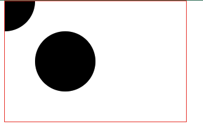
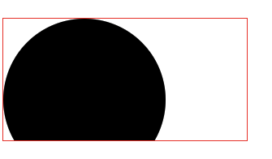
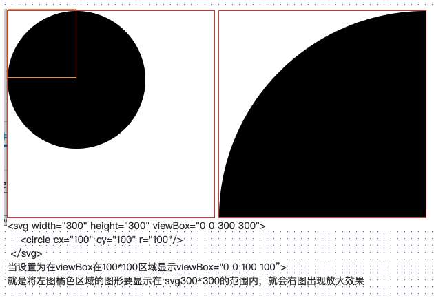
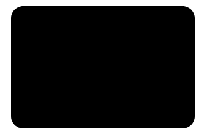
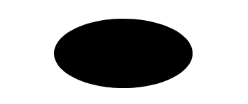
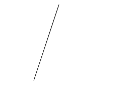
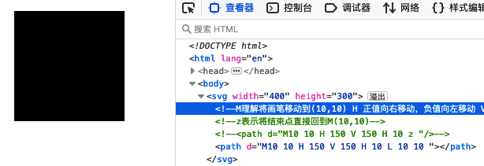
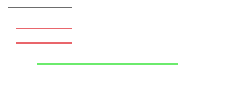
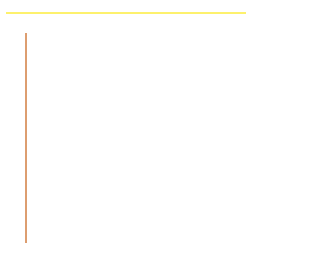

# SVG

## 介绍

SVG 是 Scalable Vector Graphics 的缩写，意为可缩放矢量图形。

SVG是一个基于文本的开放网络标准，用来定义用于网络的矢量图形

SVG图像在放大或改变尺寸的情况下其图形质量不会有所损失，因此能够优雅而简洁地渲染不同大小的图形，并和CSS，DOM，JavaScript和SMIL等其他网络标准无缝衔接

SVG 使用 XML 格式定义图形

### 优势

1. SVG 与 JPEG 和 GIF 图像比起来，尺寸更小，且可压缩性更强。
2. SVG图像中的文本是可选的，同时也是可搜索的，且可以与 JavaScript 技术一起运行
3. SVG可在图像质量不下降的情况下被放大和缩小
4. SVG可被非常多的工具读取和修改（比如文本编辑器）
5. SVG图像不依赖分辨率，可在任何的分辨率下被高质量地打印
6. SVG文件是纯粹的XML

### 缺点

1. SVG复杂度越高渲染速度就会越慢（任何过度使用DOM的应用都不快）
2. SVG不适合游戏应用，只能结合Canvas来实现
3. SVG不能动态的修改动画内容

## 初始svg

在SVG标签中绘制了一个圆形(cx、cy为圆的坐标，r为圆的半径)

```html
  <!-- 整个svg的画布宽度300*200 -->
  <svg width="300" height="200">
    <!-- 圆心0,0 -->
    <circle cx="0" cy="0" r="50"/>

    <!-- 圆心坐标：cx,cy 半径 -->
    <circle cx="100" cy="100" r="50"/>
  </svg>
```



## 属性

### width和height

width、height设置用来设置SVG的宽高。

```
<svg width="600" height="400"></svg>
```

注意：在不设置宽高的情况下，默认为300 * 150，当内部元素大于300 * 150时，大于部分会被隐藏。

举个例子看一下：在坐标为（100， 100）的地方绘制一个半径为100的圆



### viewBox

viewBox 属性定义了SVG中可以显示的区域。

`viewBox="x y w h"` x、y为起始点，w、h为显示区域的宽高。

在一个尺寸为300 * 300的SVG中绘制一个坐标为（100, 100）半径为100的圆，同时我们加上viewBox属性为"0 0 100 100"

```html
  <!-- viewBox="0 0 100 100": x、y为起始点，w、h为显示区域的宽高 -->
  <svg width="300" height="300" viewBox="0 0 300 300">
    <circle cx="100" cy="100" r="100"/>
  </svg>
  <svg width="300" height="300" viewBox="0 0 100 100">
    <circle cx="100" cy="100" r="100"/>
  </svg>
```



viewBox定义了一个：从（0, 0）点开始，宽高为100 * 100的显示区域。而这个100 * 100的显示区域会放到300 * 300(svg宽高)的SVG中去显示，整体就放大了3倍。

### xmlns和xmlns:xlink

SVG使用XML格式定义图形，SVG文件是纯粹的XML文件。

在XML中，标签和属性属于命名空间，这是为了防止来自不同技术的标签和属性发生冲突。例如在SVG中存在a标签，在HTML中也存在a标签，那么怎么区分这个a标签属于哪一种技术，这就需要使用命名空间了。 加入命名空间以后我们就能知道哪一个是svg:a，哪一个又是html:a，这样我们就可以区分出不同的标签和属性。

  xmlns用于声明命名空间（namespace），在此声明之下的所有子标签都属于这个空间内。这里看起来是一个url，但实际上仅仅是一个字符串，这样使用只是惯例。因此很多时候都会被称为”namespace url” 而不是”namespace name”。

  当我们在SVG中加入xmlns时，因为它定义了默认命名空间，因此不需要前缀，我们直接在SVG标签中写一个a标签，a标签和UA就知道它是SVG的a标签而不是HTML的a标签

xmlns:xlink 表示前缀为xlink的标签和属性，应该由理解该规范的UA 使用xlink规范 来解释。

注解：UA是User Agent的简称。User Agent是Http协议中的一部分，属于头域的组成部分。通俗地讲UA是一种向访问网站提供你所使用的浏览器类型、操作系统、浏览器内核等信息的标识。通过这个标识，用户所访问的网站可以显示不同的排版，从而为用户提供更好的体验或者进行信息统计。

示例：

```html
<svg xmlns="http://www.w3.org/2000/svg" xmlns:xlink="http://www.w3.org/1999/xlink">
    // ......
</svg>
```

## 基本图形

基本图形插入到SVG标签中的元素，如上面示例中的圆形（circle）。

### 圆（circle）

circle 标签能在屏幕上绘制⼀个圆形 

语法： <circle cx="100" cy="100" r="100"/> 

属性： cx、cy为圆的坐标，r为圆的半径 

```html
  <!-- 圆cx,cy画布的右上角 r圆半径 -->
  <svg width="300" height="300">
    <circle cx="100" cy="100" r="100"/>
  </svg>
```


### 矩形（rect）

rect标签能在屏幕上绘制⼀个矩形 

语法： <rect x="0" y="0" rx="5" ry="5" width="300" height="200"/> 

属性： x、y为矩形的起始点坐标，rx、ry为圆⻆x、y轴⽅向的半径， width、height为矩形的宽⾼ 

```html
  <!-- 矩形rect, 以x,y作为起始点画圆
    rx="20" ry="20" 形成矩形的圆角 -->
  <svg width="400" height="300">
    <rect x="10" y="10" rx="20" ry="20" width="300" height="200"/>
    // 形成椭圆效果，rx x轴半径和y轴半径进行画圆
    <rect x="10" y="10" width="300" height="200" rx="160" ry="110"></rect>
  </svg>
```



### 椭圆（ellipse）

ellipse标签⽐circle标签功能更强⼤，ellipse标签也可以实现圆形的绘制，并且还可以分别缩 

放圆形的⻓轴半径和短轴半径，从⽽达到椭圆的效果。 

语法： <ellipse cx="100" cy="100" rx="100" ry="50"/> 

属性： cx、cy为椭圆的坐标，rx为椭圆的x轴半径、ry为椭圆的y轴半径 

```html
<!-- 椭圆 cx,cy为圆心，rx为x轴坐标的半径，ry为y轴坐标的半径，将rx与ry两点之间画圆 -->
  <svg width="400" height="300">
    <ellipse cx="200" cy="150" rx="100" ry="50"/>
  </svg>
```



### 线条 line

line标签可以根据两点的坐标绘制⼀条直线 

语法： <line x1="10" x2="50" y1="110" y2="150"/> 

属性： x1、y1为起点的坐标，x2、y2为终点的坐标 

示例：

```html
  <svg width="400" height="300">
    <!-- 设置 线段描边颜色 stroke：black -->
    <line x1="50" y1="200"  x2="100" y2="50" style="stroke: #000000;"/>
  </svg>
```



### 折线 polyline

polyline标签可以把很多个点链接在⼀起成为⼀条折线。 

语法： <polyline points="0 0, 20 40, 70 80, 100 90, 200 30, 250 50" /> 

属性： points为点集数列，其中每个点都必须包含2个点位，⼀个是x坐标，⼀个是y坐标。 

```html
  <!-- 折线 -->
  <svg width="400" height="300">
    <!-- polyline中的 fill默认是填充的-->
    <polyline points="200 0, 250 0, 250 50, 300 50" />
    <!-- 把polyline默认为填充需要把fill属性设置为none，形成折线 -->
    <polyline points="0 0, 50 0, 50 50, 100 50, 150 100" fill="none" style="stroke: #000000;" />
  </svg>
```


### 多边形 polygon

polygon标签和polyline标签类似，都是由很多个点链接在⼀起的。但不同的是polygon路径中的最后⼀个点和第⼀个点是默认闭合的。 

语法： <polygon points="0 0, 20 40, 70 80, 100 90, 200 30, 250 50" /> 

属性： points为点集数列，其中每个点都必须包含2个数字，⼀个是x坐标，⼀个是y坐标。 

示例：和折线（polyline）同样的数据 

```html
 <!-- 多边形polygon -->
  <svg>
    <!-- points当points中最后一个点位不写0 0,默认最后会连接到起始点位 -->
    <polygon points="0 0, 50 0, 75 30, 75 80, 50 105, 0 105, 0 0"  fill="none" style="stroke: #000000;" />
  </svg>
```

### 路径 path

path标签是所有图形中最复杂的，但他也是最强⼤的。在SVG中最常⽤的图形就是path标签， 他可以绘制圆形、椭圆、矩形、线条、折线、多边形、⻉塞尔曲线等。 

语法： <path d="M50 50 H 200 V 200 H 50 L 50 50"/> 

属性： d为⼀个点集数列以及其它绘制路径的信息

```html
  <svg width="400" height="300">
    <!-- M理解将画笔移动到(10,10) H x轴方向点位 V y轴方向的点位 L画线移动x,y的坐标点位 -->
    <!-- z表示将结束点直接回到M(10,10) -->
    <!-- <path d="M10 10 H 150 V 150 H 10 z "/> -->
    <path d="M10 10 H 150 V 150 H 10 L 10 10 "/>
  </svg>
```



path标签的图形形状是通过属性d来定义的，属性d的值是以：命令 + 参数 的形式进⾏组合 

的，命令⼜是通过关键字来表示；概括为以下10个命令： 

- M = Move to 移动到，类似canvas中的moveTo()
- L = Line to 直线到，类似canvas中的lineTo()
- H = Horizontal Line to 水平线
- V = Vertical Line to 垂直线
- Q = Quadratic Bezier Curve to 二次贝塞尔曲线
- T = Smooth Quadratic Bezier Curve to 三次贝塞尔曲线
- C = Curve to 曲线
- S = Smooth Curve to 平滑曲线
- A = Elliptical Arc 椭圆弧
- Z = close path 闭合路径，直接回到moveTo，类似canvas中的closePath()

#### M（Move to） 

  M命令其实就是把画笔移动到某个点，就好像画笔提起来以后移动到⼀个新的位置准备开始绘制。但因为仅仅是移动画笔⽽没有绘制，所以M命令经常出现在路径的起始点，⽤来指明画笔应该从何处开始绘制。相当于画笔工具组鼠标按下，未移动进行画画。

  每⼀段路径都必须以M命令开头，如果有多个M命令则表示新路径的开始。

语法： M x y 或者 m x y  参数：x、y为坐标 

#### L（Line to） 

L命令会绘制⼀点并且和之前的点（也就是L命令前⾯的点）连成⼀条直线。 

语法： L x y 或者 l x y  参数：x、y为坐标 

```html
  <svg width="400" height="300">
    <!-- 1.起点(10,70) 画⼀条到（100,70）的直线 -->
    <path d="M10 70 L100 70" style="stroke: #000000;"/>
    <!-- 2.M命令为多个时，起点(20,100) 画⼀条到（100,100）的直线，再从(20 120)点位另起一条线 画一条到(100,120)直线 -->
    <path d="M20 100 L 100 100 M20 120 L 100 120" style="stroke: #ff0000;"/>

    <!-- 从起始点（50， 150）画⼀条到（250， 150）的直线 -->
    <!-- M命令后⾯连续跟着多个坐标点，除了第⼀个坐标点，后⾯的全部默认为隐式的L命令 -->
    <path d="M50 150 250 150" style="stroke: #00ff00;"/>
 <svg/>
```



#### H（Horizontal Line to） 

H命令可以从之前的点绘制⼀条⽔平的直线，H命令可以等价于y值和之前点相同的L命令 

语法： H x 或者 h x  参数：x轴上点位

```html
  <svg width="400" height="300">
    <!-- 起始点（10，20）画⼀条 X轴为250点 的⽔平直线-->
    <path d="M10 20 H250" style="stroke: #fff000;" />
  </svg>
```

V（Vertical Line to） 

V命令可以从之前的点绘制⼀条垂直的直线，V命令可以等价于x值和之前点相同的L命令 

语法： V y 或者 v y 参数：Y轴坐标的上点位

```html
  <svg width="400" height="300">
    <!-- 起始点（30 40）画⼀条 以y轴为 (0,250)点 的⽔平直线-->
    <path d="M30 40 V250" style="stroke: #cb5c07;" />
  </svg>
```



PS：注意连续的H命令和V命令取⼤值 

```html
  <svg>
		<!-- 注意连续的H命令和V命令取⼤值 
    这里比如 H20 小于M点坐标x轴50，水平线是从x轴的(20,0)画线到(250,0)  -->
    <path d="M50 50 H20 250" style="stroke: #ff0ecf;" />
    <path d="M50 50 V20 150" style="stroke: #0e87ff;" />

    <!-- 当后面H或V后面两个点位都大于M中的值时，取最大值画线
      起点（100,100）H250 120, 水平x轴进行画线到(250, 0)-->
    <path d="M100 100 H250 120" style="stroke: #ff0ecf;" />
    <!-- 起点（100,100）H150 80, 其中80小于M值，垂直y轴进行画线到(0,80)画线到(0,250) -->
    <path d="M100 100 V150 80" style="stroke: #0e87ff;" />
  </svg>
```


#### Z（Close path）

关闭画笔路径，将画到的点位与起点形成连线。

```html
  <svg width="400" height="300">
    <!-- 起点（50,50）向(150,0)画线，在y轴(0,150) z结束绘制路径，将点位直接移动到起点 -->
    <path d="M50 50 H150 V150 Z" fill="none" style="stroke: #000000;" />
  </svg>
```

